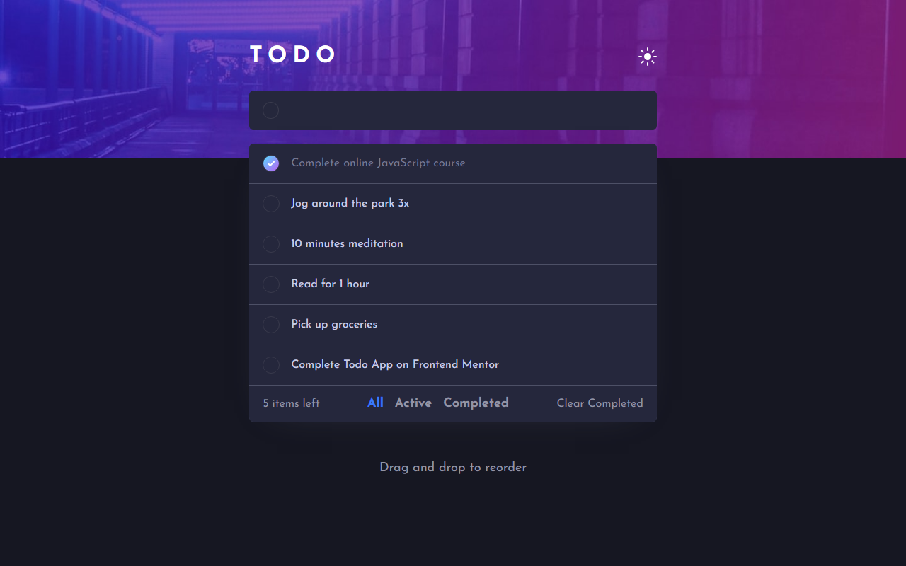

# FrontEnd Mentor challange 1

A todo webapp, with both dark and light modes. Live demo available at https://todoer.firebaseapp.com

## Screenshots

What was expected


What I built



## Project setup
```
yarn install
```

### Compiles and hot-reloads for development
```
yarn serve
```

### Compiles and minifies for production
```
yarn build
```

Built with <3 and Vue 3